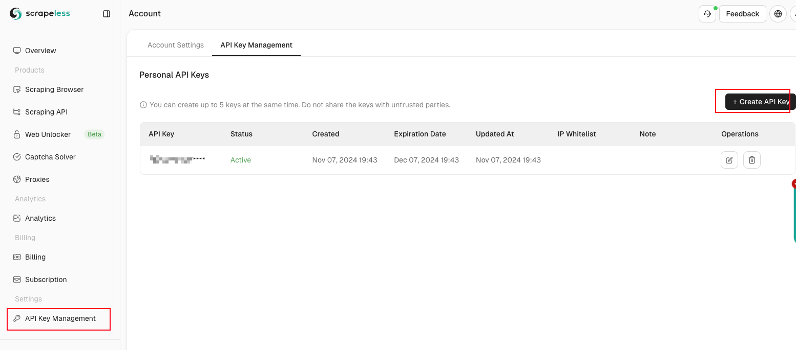
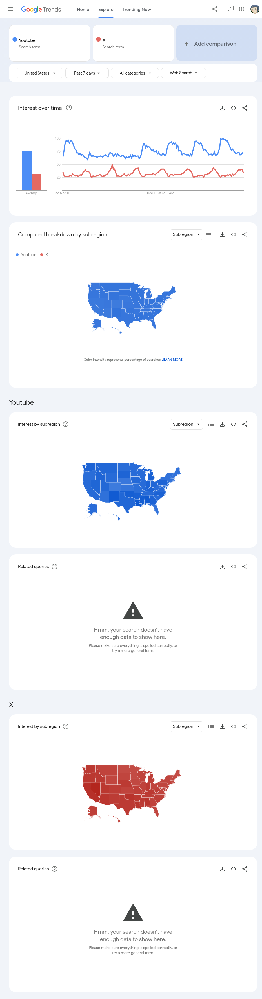

# Google Trends Scraper

A node.js script that uses the puppeteer and [Scrapeless](https://scrapeless.com/) Browserless Services to capture
Google trend data.

- [Google Trends Scraper](#google-trends-scraper)
    - [Prerequisites](#prerequisites)
    - [Getting Started](#getting-started)
        - [**Obtain an API Key**](#obtain-an-api-key)
        - [Parameter Explanation](#parameter-explanation)
    - [Installation](#installation)
    - [Configuration](#configuration)
    - [Usage](#usage)
    - [License](#license)

## Prerequisites

- **Node.js** : Version 14 or higher.

- **npm** : Node package manager.

- **Scrapeless Browserless Service** : Use the browser service provided by [Scrapeless](https://scrapeless.com/)

## Getting Started

### **Obtain an API Key**

Go to the Scraping Browser dashboard and obtain your API Key from the settings tab. We will use this API Key in the
subsequent steps.



### Parameter Explanation

Complete Scraping browser WebSocket link address

``` bash
 wss://browser.scrapeless.com/browser?token=APIKey&session_ttl=180&proxy_country=ANY
```

| **Parameter** | **Type** | **Explanation**                                                                                                                                                                                                                                                                                                                                                                                                                                                                                                                                                                                                                         |
|---------------|----------|-----------------------------------------------------------------------------------------------------------------------------------------------------------------------------------------------------------------------------------------------------------------------------------------------------------------------------------------------------------------------------------------------------------------------------------------------------------------------------------------------------------------------------------------------------------------------------------------------------------------------------------------|
| token         | string   | The API Key generated in the dashboard.                                                                                                                                                                                                                                                                                                                                                                                                                                                                                                                                                                                                 |
| session_ttl   | string   | The `session_ttl` parameter controls the duration of the session and automatically closes the browser instance after the session times out. The unit of `session_ttl` is seconds (S), with a default value of 180 seconds (i.e., 3 minutes), and can be customized between 60 seconds (1 minute) and 900 seconds (15 minutes). When the specified TTL time is reached, the session will become invalid, and Scraping Browser will close the browser instance to release resources. Please set the `session_ttl` reasonably according to the task requirements to ensure that the operations are completed before the session times out. |
| proxy_country | string   | The `proxy_country` parameter is used to set the target country of the proxy, making the request sent through the IP address of that region. You can customize the proxy source by specifying a country code for `proxy_country` (e.g., US for the United States, GB for the United Kingdom, ANY for any country). Scraping Browser will provide the corresponding IP address based on the specified country, which helps meet regional access restrictions or geographic positioning needs.                                                                                                                                            |

## Installation

1. **Install Dependencies**

```bash
npm install
```

## Configuration

1. **Environment Variables** Create a `.env` file in the project root directory and add your API key:

```sh
API_KEY=your_scrapeless_api_key
```

2. **Script Configuration**
   The script is pre-configured to fetch trends for "youtube" and "twitter" in the US over the past 7 days. To
   customize:

- **Change Keywords** : Modify the `q` parameter in the `QUERY_PARAMS` variable.

- **Change Geography** : Update the `geo` parameter.

- **Adjust Date Range** : Alter the `date` parameter as needed.


3. **Set cookies**
   In order to ensure that your `interest over time` data is displayed stably, you need to set cookies through puppeteer
   before visiting the site.
   ``` js
      const cookies = JSON.parse(fs.readFileSync('./data/cookies.json', 'utf-8'));
      await browser.setCookie(...cookies);
   ```
   You can access the cookies here in your browser and log in to https://trends.google.com to export cookie.json. If you
   don’t know how to export cookies you can try to use
   this [browser extension](https://chromewebstore.google.com/detail/cookie-editor/hlkenndednhfkekhgcdicdfddnkalmdm) to
   export cookies in json format.

## Usage

Run the script using Node.js:

```bash
node index.js
```

Upon execution:

- The script connects to the remote browser.

- Setting cookies through puppeteer

- Navigates to Google Trends with specified parameters.

- Extracts trend data and logs it to the console.

- Saves a screenshot of the trends page as `trends.png`, And update cookies.

- Handles any rate limiting by reloading the page if a 429 error is encountered.

After successful execution, you will see:

- result data: [result.json](data/trends.json)


- screenshots

  

## License

This project is licensed under the [MIT License](./LICENSE) .

---

**Disclaimer** : Scraping websites may violate their terms of service. Ensure you have permission to scrape Google
Trends and use this script responsibly.
